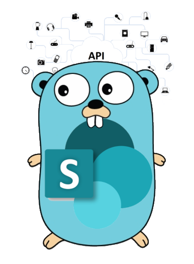

# Introduction

 [](https://goreportcard.com/report/github.com/koltyakov/gosip) [](https://codecov.io/gh/koltyakov/gosip) [](https://github.com/koltyakov/gosip/blob/master/LICENSE) [](https://github.com/avelino/awesome-go)



## Main features

* Unattended authentication using different strategies.
* [Fluent API](api/fluent.md) syntax for SharePoint object model.
* Simplified API consumption \(REST, CSOM, SOAP, etc.\).
* SharePoint-aware embedded features \(retries, header presets, error handling\).

### Supported SharePoint versions

* SharePoint Online \(SPO\).
* On-Premises \(2019/2016/2013\).

### Supported auth strategies

* SharePoint On-Premises 2019/2016/2013:
  * [User credentials](auth/strategies/ntlm.md) \(NTLM\)
  * [ADFS user credentials](auth/strategies/adfs.md) \(ADFS, WAP -&gt; Basic/NTLM, WAP -&gt; ADFS\)
  * Behind a reverse proxy \([Forefront TMG](auth/strategies/tmg.md), [WAP -&gt; Basic/NTLM](auth/strategies/adfs.md), [WAP -&gt; ADFS](auth/strategies/adfs.md)\)
  * [Form-based authentication](auth/strategies/fba.md) \(FBA\)
  * [On-Demand authentication](auth/custom-auth/on-demand.md)
* SharePoint Online:
  * [SAML](auth/strategies/saml.md) based with user credentials
  * [Add-In only](auth/strategies/addin.md) permissions
  * ADFS user credentials \(automatically detects in [SAML](auth/strategies/saml.md) strategy\)
  * [Azure Device flow](auth/custom-auth/azure-device-flow.md)
  * [On-Demand authentication](auth/custom-auth/on-demand.md)

## Installation

```bash
go get github.com/koltyakov/gosip
```

## Usage insights

1. Understand SharePoint environment type and authentication strategy.

Let's assume it's, SharePoint Online and Add-In Only permissions. Then `strategy "github.com/koltyakov/gosip/auth/addin"` sub package should be used.

```go
package main

import (
    "github.com/koltyakov/gosip"
    "github.com/koltyakov/gosip/api"
    strategy "github.com/koltyakov/gosip/auth/addin"
)
```

1. Initiate authentication object.

```go
auth := &strategy.AuthCnfg{
    SiteURL:      os.Getenv("SPAUTH_SITEURL"),
    ClientID:     os.Getenv("SPAUTH_CLIENTID"),
    ClientSecret: os.Getenv("SPAUTH_CLIENTSECRET"),
}
```

AuthCnfg's from different strategies contains different options relevant for a specified auth type.

The authentication options can be provided explicitly or can be read from a configuration file \(see [more](auth/overview.md#authentication-strategies)\).

```go
configPath := "./config/private.json"
auth := &strategy.AuthCnfg{}

err := auth.ReadConfig(configPath)
if err != nil {
    fmt.Printf("Unable to get config: %v\n", err)
    return
}
```

1. Bind auth client with Fluent API.

```go
client := &gosip.SPClient{AuthCnfg: auth}

sp := api.NewSP(client)

res, err := sp.Web().Select("Title").Get()
if err != nil {
    fmt.Println(err)
}

fmt.Printf("%s\n", res.Data().Title)
```

## Usage samples

### Fluent API client

Provides a simple way of constructing API endpoint calls with IntelliSense and chainable syntax.

```go
package main

import (
    "encoding/json"
    "fmt"
    "log"

    "github.com/koltyakov/gosip"
    "github.com/koltyakov/gosip/api"
    strategy "github.com/koltyakov/gosip/auth/addin"
)

func main() {
    // Getting auth params and client
    client, err := getAuthClient()
    if err != nil {
        log.Fatalln(err)
    }

    // Binding SharePoint API
    sp := api.NewSP(client)

    // Custom headers
    headers := map[string]string{
        "Accept": "application/json;odata=minimalmetadata",
        "Accept-Language": "de-DE,de;q=0.9",
    }
    config := &api.RequestConfig{Headers: headers}

    // Chainable request sample
    data, err := sp.Conf(config).Web().Lists().Select("Id,Title").Get()
    if err != nil {
        log.Fatalln(err)
    }

    // Response object unmarshalling
    // (struct depends on OData mode and API method)
    res := &struct {
        Value []struct {
            ID    string `json:"Id"`
            Title string `json:"Title"`
        } `json:"value"`
    }{}

    if err := json.Unmarshal(data, &res); err != nil {
        log.Fatalf("unable to parse the response: %v", err)
    }

    for _, list := range res.Value {
        fmt.Printf("%+v\n", list)
    }

}

func getAuthClient() (*gosip.SPClient, error) {
    configPath := "./config/private.spo-addin.json" // <- file with creds
    auth := &strategy.AuthCnfg{}
    if err := auth.ReadConfig(configPath); err != nil {
        return nil, fmt.Errorf("unable to get config: %v", err)
    }
    return &gosip.SPClient{AuthCnfg: auth}, nil
}
```

### Generic HTTP-client helper

Provides generic GET/POST helpers for REST operations, reducing amount of `http.NewRequest` scaffolded code, can be used for custom or not covered with a Fluent API endpoints.

```go
package main

import (
    "fmt"
    "log"

    "github.com/koltyakov/gosip"
    "github.com/koltyakov/gosip/api"
    strategy "github.com/koltyakov/gosip/auth/ntlm"
)

func main() {
    configPath := "./config/private.ntlm.json"
    auth := &strategy.AuthCnfg{}

    if err := auth.ReadConfig(configPath); err != nil {
        log.Fatalf("unable to get config: %v\n", err)
    }

    sp := api.NewHTTPClient(&gosip.SPClient{AuthCnfg: auth})

    endpoint := auth.GetSiteURL() + "/_api/web?$select=Title"

    data, err := sp.Get(endpoint, nil)
    if err != nil {
        log.Fatalf("%v\n", err)
    }

    // sp.Post(endpoint, []byte(body), nil) // generic POST

    // generic DELETE helper crafts "X-Http-Method"="DELETE" header
    // sp.Delete(endpoint, nil)

    // generic UPDATE helper crafts "X-Http-Method"="MERGE" header
    // sp.Update(endpoint, nil)

    // CSOM helper (client.svc/ProcessQuery)
    // sp.ProcessQuery(endpoint, []byte(body))

    fmt.Printf("response: %s\n", data)
}
```

### Low-level HTTP-client usage

Low-lever SharePoint-aware HTTP client from `github.com/koltyakov/gosip` package for custom or not covered with a Fluent API client endpoints with granular control for HTTP request, response, and `http.Client` parameters. Used internally but almost never required in a consumer code.

```go
client := &gosip.SPClient{AuthCnfg: auth}

var req *http.Request
// Initiate API request
// ...

resp, err := client.Execute(req)
if err != nil {
    fmt.Printf("Unable to request api: %v", err)
    return
}
```

SPClient has `Execute` method which is a wrapper function injecting SharePoint authentication and ending up calling `http.Client`'s `Do` method.

## Reference

Many auth flows have been "copied" from [node-sp-auth](https://github.com/s-kainet/node-sp-auth) library \(used as a blueprint\), which we intensively use in Node.js ecosystem for years.

Fluent API and wrapper syntax are inspired by [PnPjs](https://github.com/pnp/pnpjs) which is also the first-class citizen on almost all our Node.js and front-end projects with SharePoint involved.

## License

[](https://app.fossa.io/projects/git%2Bgithub.com%2Fkoltyakov%2Fgosip?ref=badge_large)

