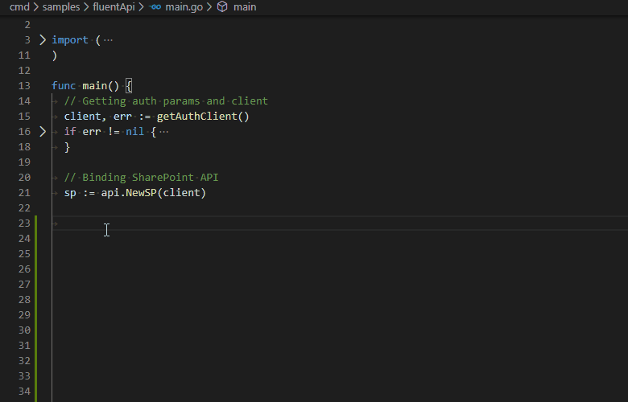

# Fluent API

Provides a simple way of constructing API endpoint calls with IntelliSense and chainable syntax.



### Usage sample

```go
package main

import (
    "encoding/json"
    "fmt"
    "log"

    "github.com/koltyakov/gosip"
    "github.com/koltyakov/gosip/api"
    strategy "github.com/koltyakov/gosip/auth/addin"
)

func main() {
    // Getting auth params and client
    client, err := getAuthClient()
    if err != nil {
        log.Fatalln(err)
    }

    // Binding SharePoint API
    sp := api.NewSP(client)

    // Custom headers
    headers := map[string]string{
        "Accept": "application/json;odata=minimalmetadata",
        "Accept-Language": "de-DE,de;q=0.9",
    }
    config := &api.RequestConfig{Headers: headers}

    // Chainable request sample
    data, err := sp.Conf(config).Web().Lists().Select("Id,Title").Get()
    if err != nil {
        log.Fatalln(err)
    }

    // Response object unmarshalling (struct depends on OData mode and API method)
    res := &struct {
        Value []struct {
            ID    string `json:"Id"`
            Title string `json:"Title"`
        } `json:"value"`
    }{}

    if err := json.Unmarshal(data, &res); err != nil {
        log.Fatalf("unable to parse the response: %v", err)
    }

    for _, list := range res.Value {
        fmt.Printf("%+v\n", list)
    }

}

func getAuthClient() (*gosip.SPClient, error) {
    configPath := "./config/private.spo-addin.json"
    auth := &strategy.AuthCnfg{}
    if err := auth.ReadConfig(configPath); err != nil {
        return nil, fmt.Errorf("unable to get config: %v", err)
    }
    return &gosip.SPClient{AuthCnfg: auth}, nil
}
```

### Main concepts

* Get authenticated
* Construct root `SP` object using `api.NewSP(client)`
* Construct API calls in a fluent way
* Parse responses in a Go way
* Embrase strongly typed generic responses

