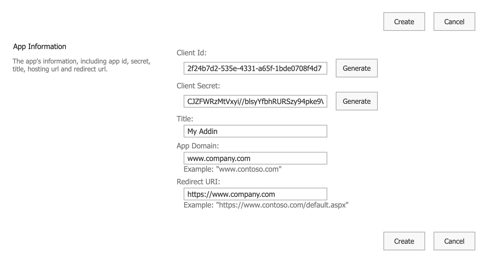
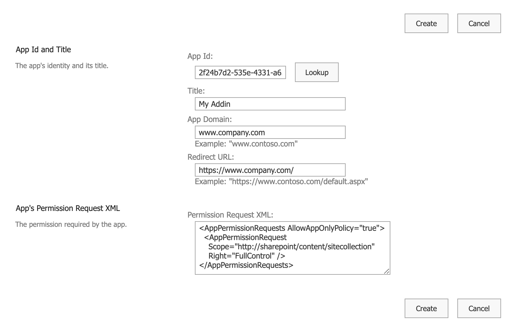
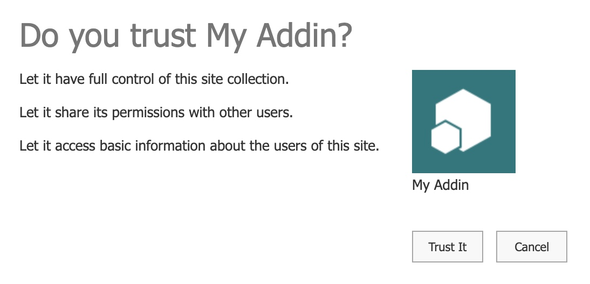

# Configuration

For AddIn Only authentication to work register new addin within your SharePoint Online tenant.

* Navigate to app registration page: https://{organization}.sharepoint.com/sites/{site}/\_layouts/15/appregnew.aspx
* Click "Generate" button next to Client Id and Client Secret, fill in Title, App Domain, Redirect URI (you can type in any values you want).

<figure><figcaption></figcaption></figure>

* Copy Client Id and Client Secret and press "Create" button.
* Apply permissions for the app on tenant or site collection level.

#### Tenant scoped parmissions

https://{organization}-admin.sharepoint.com/\_layouts/15/appinv.aspx

```xml
<AppPermissionRequests AllowAppOnlyPolicy="true">
  <AppPermissionRequest
    Scope="http://sharepoint/content/tenant"
    Right="FullControl" />
</AppPermissionRequests>
```

#### Site collection scoped permissions

https://{organization}.sharepoint.com/sites/{site}/\_layouts/15/appinv.aspx

```xml
<AppPermissionRequests AllowAppOnlyPolicy="true">
  <AppPermissionRequest
    Scope="http://sharepoint/content/sitecollection"
    Right="FullControl" />
</AppPermissionRequests>
```

* Resolve addin by Client Id and paste in App's Permissions Request XML:

<figure><figcaption></figcaption></figure>

* Click "Create" and "Trust It".

<figure><figcaption></figcaption></figure>

To check which app principals are assigned for a site collection use:

https://{organization}.sharepoint.com/sites/{site}/\_layouts/15/appprincipals.aspx

### Disabled by default

In new subscriptions you could be needed to enable Grant App Permission. Connect to SharePoint using Windows PowerShell and then run:&#x20;

`set-spotenant -DisableCustomAppAuthentication $false`.

```powershell
Install-Module -Name Microsoft.Online.SharePoint.PowerShell  
$adminUPN="<the full email address of a SharePoint administrator account, example: jdoe@contosotoycompany.onmicrosoft.com>"  
$orgName="<name of your Office 365 organization, example: contosotoycompany>"  
$userCredential = Get-Credential -UserName $adminUPN -Message "Type the password."  
Connect-SPOService -Url https://$orgName-admin.sharepoint.com -Credential $userCredential  
set-spotenant -DisableCustomAppAuthentication $false  
```

